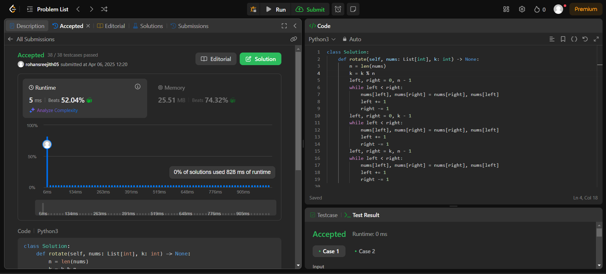

# ACMrecruitment
***
## Progress:
### Day 1 (01-04-2025):
  - Reviced Data Preprocessing
  - Revised Visualization
  - Started with Striver's A2Z sheet (Array - easy)
  - Finished "Largest element in an array"
    
  - Finished "Second Largest Element in an Array without sorting"
    
  - Finished "Check if the array is sorted"
    
  - Finished "Remove duplicates from Sorted array"
    
### Day 2 (02-04-2025):
  - Reviced Data Preprocessing
  - Revised Visualization
  - Continued with Striver's A2Z sheet (Array - easy)
  - Finished "Left Rotate an array by one place"
    
  - Finished "Left rotate an array by D places"
    
  - Finished "Move Zeros to end"
    
  - Finished "Linear Search"
    
  - Finished "Find the Union"
    
### Day 3 (03-04-2025):
  - Reviced Data Preprocessing
  - Revised Visualization
  - Finished with Striver's A2Z sheet (Array - easy)
  - Finished "Find missing number in an array"
    
  - Finished "Maximum Consecutive Ones"
    
  - Finished "Find the number that appears once, and other numbers twice."
    
  - Finished "Longest subarray with given sum K(positives)"
    .png)
  - Finished "Longest subarray with sum K (Positives + Negatives)"
    .png)
### Day 4 (04-04-2025):
  - Reviced Algorithms
  - Revised Evaluation Matrics
  - Implementing Linear Regression
  - Implementing Gradient Descent
  - Implementing K-Means Algorithm
### Day 5 (05-04-2025):
  - Reviced Algorithms
  - Revised Evaluation Matrics
  - Implementing Linear Regression
  - Implementing Gradient Descent
  - Implementing K-Means Algorithm
### Day 6 (06-04-2025):
  - Reviced Algorithms
  - Revised Evaluation Matrics
  - Implementing Linear Regression
      -Code: .png)
      -Output: .png)
  - Implementing Gradient Descent
      -Code: .png)
      -Output: .png)
  - Implementing K-Means Algorithm
      -Code: .png)
      -Output: .png)
